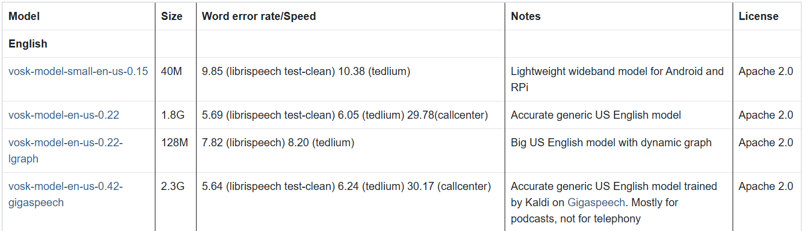

# 🎧 Speech-to-Text (STT) with Vosk

This project is a **Speech-to-Text (STT) system** that utilizes **Vosk** for offline speech recognition. It processes an audio file, converts it into the correct format, and then transcribes it into text.

## 🚀 Features

- ✅ **Offline Speech Recognition** using the **Vosk** API  
- 🎧 **Supports WAV audio files**  
- 📝 **Generates accurate transcriptions**  
- 🛆 **Lightweight and efficient**  

---

## 💂️ Project Structure

> **Note:** Before running the project, download, extract, and rename the **Vosk** model folders and place them in the project directory.

```
stt-vosk-py/
│── .gitignore                     # Git ignore file
│── main.py                         # Main script to process and transcribe audio
│── util.py                         # Utility functions for audio processing
│── requirements.txt                 # Dependencies for the project
│── README.md                        # Project documentation
│── harvard.wav                      # Example input audio file
│── sample.wav                       # Processed audio file
│── srt-3.5.3-py3-none-any.whl       # Wheel file for SRT
│── vosk-model-en-us-medium-lgraph/  # Pre-trained medium Vosk model (❗ Required)
```

---

## 🛠️ Installation & Setup

### 1️⃣ Clone the Repository

```sh
git clone <repository-url>
cd stt-vosk-py
```

### 2️⃣ Install Dependencies  

#### ✅ **Automatic Installation**
```sh
pip install -r requirements.txt
```

#### 🛠 **Manual Installation**
```sh
pip install pydub
pip install vosk
pip install srt-3.5.3-py3-none-any.whl
```

### 3️⃣ Download & Set Up the Vosk Model  

1. Download the Vosk models from [Vosk Models](https://alphacephei.com/vosk/models).

 #### Example for English US models

2. Extract the model and rename it as:
   - `vosk-model`

3. Place it inside the **project directory**.

---

## 🚀 Usage

1. Ensure your input audio file (`harvard.wav`) is available in the project directory.  
2. Run the main script:  
   ```sh
   python main.py
   ```
3. The transcribed text will be **printed in the console**.  

---